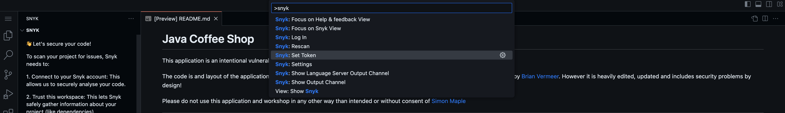

# Snyk CTF Event: Multi-Challenge Repository

This repository contains multiple folders, each representing a separate GitHub repository and challenge for the Snyk CTF event. Each folder includes the full source code for its respective vulnerability challenge.

## Getting Started

You can clone this entire repository to your IDE (such as GitHub Codespaces or VS Code) to access all the challenges in one place:

```bash
git clone <repo-url>
```

## Codespaces & Dev Container Environment

This repo includes a preconfigured `.devcontainer` setup for GitHub Codespaces and VS Code Dev Containers. The environment provides:

- **Java (OpenJDK 21)** with Maven
- **Node.js (LTS)**
- **Python 3**
- **Docker-in-Docker**
- **GitHub CLI**
- **Postman** (for API testing)
- **Snyk CLI** and Snyk VS Code extension
- **VS Code extensions** for Snyk, REST Client, Python, and Docker
- Common ports (27017, 8080, 8000, 5000) are forwarded for web apps and databases

### Authentication
Snyk is preconfigured to use Token authentication for scanning vulnerabilities.

## Using Snyk to Find Vulnerabilities

Once cloned, use the Snyk plugin in your IDE to scan all the folders and quickly identify vulnerabilities across all challenges.

## Structure

- Each folder is a standalone challenge with its own codebase.
- You can work on each challenge independently or all at once.

## How to Use

1. Clone the repo.
2. Open in Codespaces or VS Code.
3. Use Snyk to scan for vulnerabilities.
4. Use the terminal and Postman extension to interact with the challenges and find flags.

## Codespaces / Snyk Setup Instructions

1. Under Snyk -> 'General Settings' you should see a field under 'API Token' - create your API key and copy it:

   

2. If your Codespace is now ready, open the Command Palette (Cmd + Shift + P on Mac; Ctrl + Shift + P on Windows) and type Snyk:

   

## Note

This repo is designed for security training and CTF purposes. Do not use in production.

---

Happy hacking!
